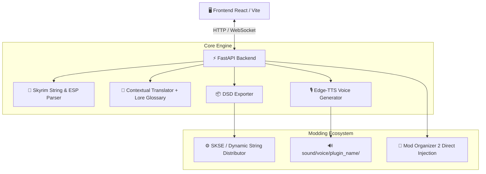

# ⚔️ Skyrim AI Translation Agent

[](https://github.com/FacundoSu1986/skyrim-ai-translator/actions/workflows/ci.yml)
[](https://www.python.org/downloads/)
[](https://react.dev/)
[](LICENSE)
[](https://coderabbit.ai)
[-4b8bbe.svg)](https://qodo.ai)

**Traductor automático de mods de Skyrim** con doblaje neural: un sistema
integral para la **localización, traducción contextual y síntesis de voz (TTS)**
de mods de **The Elder Scrolls V: Skyrim (Special Edition / Anniversary
Edition)**.

Procesa archivos `.strings`, `.dlstrings`, `.ilstrings` y plugins `.esp`
directamente, genera traducciones al español respetando el *lore* y el glosario
del juego, sintetiza los diálogos en audio neural de alta calidad con
**Edge-TTS**, exporta a **Dynamic String Distributor (DSD)** e inyecta el
resultado en **Mod Organizer 2 (MO2)** sin pasos manuales.

> ⚖️ Proyecto comunitario independiente. **No está afiliado, patrocinado ni
> respaldado por Bethesda Softworks LLC ni ZeniMax Media Inc.** Antes de
> publicar una traducción de un mod ajeno, lee
> [Permisos y uso responsable](#permisos).

---

## 🌟 Características Principales

- 📜 **Parser Universal de Skyrim**: Lee y procesa formatos de localización nativos (`.strings`, `.dlstrings`, `.ilstrings`) y parseo binario de registros `INFO`/`QUST` en `.esp`.
- 🧠 **Traducción Contextual con Lore**:
  - Motor de traducción con compatibilidad OpenAI / DeepSeek / Ollama / OpenRouter.
  - Traductor gratuito de alta velocidad con reintentos y control de concurrencia.
  - Glosario oficial de Skyrim integrado (ej. *Dragonborn* ➔ *Sangre de Dragón*, *Whiterun* ➔ *Carrera Blanca*).
- 🎙️ **Generación de Voz Neural (Edge-TTS)**:
  - Generación asíncrona de audios `.mp3` para cada línea de diálogo.
  - Mapeo automático de actores y tipos de voz (`MaleNord`, `FemaleNord`, etc.) a carpetas estructuradas de Skyrim (`sound/voice/...`).
- ⚡ **Exportador a Dynamic String Distributor (DSD)**: Genera archivos JSON compatibles con el plugin de SKSE *Dynamic String Distributor*.
- 📂 **Integración Nativa con Mod Organizer 2 (MO2)**:
  - Detección automática del directorio de MO2.
  - Escaneo de mods instalados y procesamiento directo.
  - Inyección automática de traducciones y audios generados en la carpeta del mod.
- 🎨 **Interfaz Nórdica Premium (React + Vite)**:
  - UI interactiva inspirada en Skyrim con runas, efectos metálicos, arrastrar y soltar JSON/mods, y logs en tiempo real vía **WebSockets**.

---

## 🏗️ Arquitectura del Sistema



---

## 🚀 Inicio Rápido

### 1. Clonar el Repositorio
```bash
git clone https://github.com/FacundoSu1986/skyrim-ai-translator.git
cd skyrim-ai-translator
```

### 2. Backend (FastAPI + Python)
```bash
# Crear y activar entorno virtual (opcional pero recomendado)
python -m venv venv
# En Windows:
venv\Scripts\activate
# En Linux/macOS:
source venv/bin/activate

# Instalar dependencias
pip install -r requirements.txt

# Iniciar servidor API (puerto 8000)
python api.py
```

### 3. Frontend (React + Vite)
```bash
cd frontend
npm install
npm run dev
```
Abre tu navegador en `http://localhost:5173`.

Para generar el build de producción:
```bash
cd frontend
npm run build      # genera dist/, incluidos robots.txt y sitemap.xml
```

Todos los metadatos públicos (título, descripción, palabras clave, URL canónica,
tarjetas Open Graph) viven en un único archivo, [`frontend/site.config.js`](frontend/site.config.js).
El plugin SEO de [`frontend/vite.config.js`](frontend/vite.config.js) los inyecta
en el HTML y emite `robots.txt` y `sitemap.xml` en cada build, de modo que la URL
canónica nunca se desincroniza. Para publicar en otro dominio:

```bash
SITE_URL=https://mi-dominio.dev npm run build
```

Las tipografías se sirven desde el propio bundle: la aplicación **no hace
ninguna petición a servidores de terceros** en tiempo de ejecución.

### 4. Modo Línea de Comandos (CLI)
También puedes ejecutar el flujo por lotes mediante el CLI:
```bash
python main.py --input test_input.json --lang Spanish --voice es-ES-AlvaroNeural --plugin MiMod.esp
```

---

## 🧪 Pruebas Automatizadas

El proyecto cuenta con una suite completa de pruebas unitarias e integración:

```bash
pytest --verbose
```

---

## 🤖 Política de Gobernanza de Bots de Revisión

Para optimizar el uso de tokens y evitar gastos innecesarios de cuotas de API:

- 🚫 **GitHub Copilot PR Reviewer / OpenAI Codex Bots**: Desactivados / Omitidos para escaneos automáticos de Pull Requests en este repositorio.
- ✅ **CodeRabbit & Qodo (PR-Agent)**: Configurados como los únicos revisores oficiales de código y PRs (`.coderabbit.yaml` y `.pr_agent.toml`).

---

<a id="permisos"></a>

## ⚖️ Permisos, licencias y uso responsable

### Licencia del proyecto

Este proyecto está bajo la **Licencia MIT**. Consulta [LICENSE](LICENSE).

Las licencias de todas las dependencias, tipografías y servicios externos están
inventariadas en [THIRD-PARTY-NOTICES.md](THIRD-PARTY-NOTICES.md). El análisis
completo de compatibilidad y cumplimiento está en
[docs/legal/COMPLIANCE-REVIEW.md](docs/legal/COMPLIANCE-REVIEW.md).

### Marcas registradas

«The Elder Scrolls», «Skyrim» y «Bethesda» son marcas registradas de ZeniMax
Media Inc. y Bethesda Softworks LLC. Se usan aquí de forma **nominativa**, solo
para identificar el juego con el que la herramienta es compatible.

**Este proyecto no está afiliado, patrocinado ni respaldado por Bethesda
Softworks LLC ni ZeniMax Media Inc.**

### ⚠️ Antes de publicar una traducción

Una traducción es una **obra derivada**: traducir el mod de otra persona y
publicarlo requiere el permiso de su autor.

- **Comprueba el bloque de permisos** de la página del mod original (en Nexus
  Mods, cada mod declara si admite traducciones y bajo qué condiciones).
- **Pide autorización al autor** cuando los permisos no sean explícitos.
- **Publica un parche, no un repaquetado.** La salida DSD de esta herramienta ya
  es un JSON de sustitución de cadenas que depende del mod original, que es
  justo lo que la mayoría de autores exige.
- **No redistribuyas el audio original** del mod si ya venía doblado.

Usar la herramienta para tu propia partida no plantea ningún problema. La
responsabilidad aparece al publicar.

### Servicios externos

Dos de los caminos por defecto se apoyan en servicios que no exponen una API
pública para este uso:

| Servicio | Para qué | Alternativa conforme |
|----------|----------|----------------------|
| Endpoint web de Google Translate | Modo de traducción «gratuito» | Google Cloud Translation API, DeepL, o el camino LLM ya incluido |
| Servicio de voz de Microsoft Edge (vía `edge-tts`) | Doblaje neural | Azure AI Speech, Piper (MIT), Coqui TTS |

Funcionan, pero pueden cortarse sin aviso y su uso es responsabilidad de quien
despliega la herramienta. Si el proyecto va a tener cualquier dimensión
comercial, migra a las alternativas de la columna derecha. El detalle está en
los hallazgos H-02 y H-03 de la
[revisión de cumplimiento](docs/legal/COMPLIANCE-REVIEW.md).
