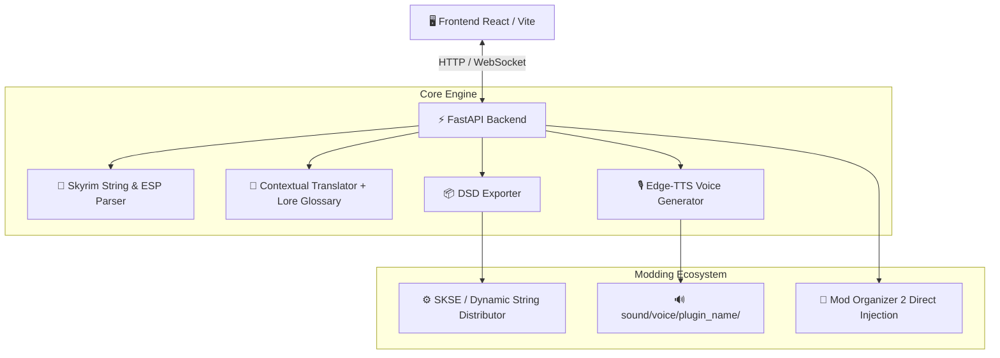

# ⚔️ Skyrim AI Translation Agent

[](https://github.com/FacundoSu1986/skyrim-ai-translator/actions/workflows/ci.yml)
[](https://www.python.org/downloads/)
[](https://react.dev/)
[](LICENSE)
[](https://coderabbit.ai)
[-4b8bbe.svg)](https://qodo.ai)

Un sistema integral e inteligente para la **localización, traducción contextual y síntesis de voz (TTS)** de mods para **The Elder Scrolls V: Skyrim (Special Edition / Anniversary Edition)**.

Permite procesar archivos `.strings`, `.dlstrings`, `.ilstrings`, y plugins `.esp` directamente, generar traducciones contextuales respetando el *lore* y glosario oficial, sintetizar diálogos en audio neural de alta calidad con **Edge-TTS**, exportar a **Dynamic String Distributor (DSD)** e inyectar directamente en **Mod Organizer 2 (MO2)**.

---

## 🌟 Características Principales

- 📜 **Parser Universal de Skyrim**: Lee y procesa formatos de localización nativos (`.strings`, `.dlstrings`, `.ilstrings`) y parseo binario de registros `INFO`/`QUST` en `.esp`.
- 🧠 **Traducción Contextual con Lore**:
  - Motor de traducción con compatibilidad OpenAI / DeepSeek / Ollama / OpenRouter.
  - Traductor gratuito de alta velocidad con reintentos y control de concurrencia.
  - Glosario oficial de Skyrim integrado (ej. *Dragonborn* ➔ *Sangre de Dragón*, *Whiterun* ➔ *Carrera Blanca*).
- 🎙️ **Generación de Voz Neural (Edge-TTS)**:
  - Generación asíncrona de audios `.mp3` para cada línea de diálogo.
  - Mapeo automático de actores y tipos de voz (`MaleNord`, `FemaleNord`, etc.) a carpetas estructuradas de Skyrim (`sound/voice/...`).
- ⚡ **Exportador a Dynamic String Distributor (DSD)**: Genera archivos JSON compatibles con el plugin de SKSE *Dynamic String Distributor*.
- 📂 **Integración Nativa con Mod Organizer 2 (MO2)**:
  - Detección automática del directorio de MO2.
  - Escaneo de mods instalados y procesamiento directo.
  - Inyección automática de traducciones y audios generados en la carpeta del mod.
- 🎨 **Interfaz Nórdica Premium (React + Vite)**:
  - UI interactiva inspirada en Skyrim con runas, efectos metálicos, arrastrar y soltar JSON/mods, y logs en tiempo real vía **WebSockets**.

---

## 🏗️ Arquitectura del Sistema



---

## 🚀 Inicio Rápido

### 1. Clonar el Repositorio
```bash
git clone https://github.com/FacundoSu1986/skyrim-ai-translator.git
cd skyrim-ai-translator
```

### 2. Backend (FastAPI + Python)
```bash
# Crear y activar entorno virtual (opcional pero recomendado)
python -m venv venv
# En Windows:
venv\Scripts\activate
# En Linux/macOS:
source venv/bin/activate

# Instalar dependencias
pip install -r requirements.txt

# Iniciar servidor API (puerto 8000)
python api.py
```

### 3. Frontend (React + Vite)
```bash
cd frontend
npm install
npm run dev
```
Abre tu navegador en `http://localhost:5173`.

### 4. Modo Línea de Comandos (CLI)
También puedes ejecutar el flujo por lotes mediante el CLI:
```bash
python main.py --input test_input.json --lang Spanish --voice es-ES-AlvaroNeural --plugin MiMod.esp
```

---

## 🧪 Pruebas Automatizadas

El proyecto cuenta con una suite completa de pruebas unitarias e integración:

```bash
pytest --verbose
```

---

## 🤖 Política de Gobernanza de Bots de Revisión

Para optimizar el uso de tokens y evitar gastos innecesarios de cuotas de API:

- 🚫 **GitHub Copilot PR Reviewer / OpenAI Codex Bots**: Desactivados / Omitidos para escaneos automáticos de Pull Requests en este repositorio.
- ✅ **CodeRabbit & Qodo (PR-Agent)**: Configurados como los únicos revisores oficiales de código y PRs (`.coderabbit.yaml` y `.pr_agent.toml`).

---

## 📄 Licencia

Este proyecto está bajo la Licencia MIT. Consulta el archivo [LICENSE](LICENSE) para más detalles.
