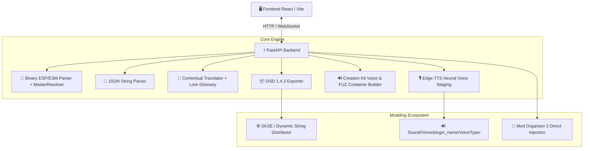

# ⚔️ Skyrim AI Translation Agent

[](https://github.com/FacundoSu1986/skyrim-ai-translator/actions/workflows/ci.yml)
[](https://www.python.org/downloads/)
[](https://react.dev/)
[](LICENSE)
[](https://coderabbit.ai)
[-4b8bbe.svg)](https://qodo.ai)

Un sistema integral para la **localización, traducción contextual y síntesis de voz (TTS)** de mods para **The Elder Scrolls V: Skyrim (Special Edition / Anniversary Edition)**.

El proyecto permite extraer y procesar cadenas y diálogos desde volcados JSON y plugins binarios `.esp`/`.esm`, generar traducciones contextuales respetando el *lore* y glosario oficial, sintetizar diálogos en audio neural con **Edge-TTS**, exportar a **Dynamic String Distributor (DSD)** de SKSE e inyectar directamente en **Mod Organizer 2 (MO2)**.

---

## 🌟 Estado y Capacidades Implementadas

- 📜 **Extracción y Parseo de Skyrim**:
  - **Plugins Binarios (`.esp` / `.esm`)**: Extracción directa de registros translatables implementados (`INFO` para diálogos con resolución de actores/temas y `QUST` para nombres/objetivos de misiones, así como `DIAL`, `BOOK`, `MESG`, `NPC_`, `WEAP`, `ARMO`, `SPEL`, `ACTI`, `ALCH`, `PERK`, `MGEF`, `FACT`, `RACE`, `MISC`, `FLOR`, `LCTN`) con resolución jerárquica de maestros (`MasterResolver`).
  - **Esquemas JSON (`parser.py`)**: Ingesta y validación de volcados de cadenas estructuradas (`StringEntry`).
  - ⚠️ *Limitaciones Actuales*: El parseo directo de archivos binarios localizados nativos (`.strings`, `.dlstrings`, `.ilstrings`) no está soportado aún (los plugins con flag `FLAG_LOCALIZED` se omiten para evitar ingerir StringIDs binarios como texto). Soporte parcial de `.esl`: las referencias a FormIDs con prefijo de plugin ligero `0xFE` no están soportadas todavía.
- 🧠 **Traducción Contextual con Lore**:
  - **Modo LLM**: Compatible con OpenAI, DeepSeek, Ollama, Groq y proveedores compatibles, con inyección dinámica del glosario oficial canónico en el *system prompt*.
  - **Modo Gratuito**: Traducción neuronal de alta velocidad con reintentos, control de concurrencia y protección estricta de placeholders contra el glosario.
  - **Glosario Canónico**: `SKYRIM_GLOSSARY` integrado como fuente única de verdad para términos de lore (ej. *Dragonborn* ➔ *Sangre de Dragón*, *Whiterun* ➔ *Carrera Blanca*).
- 🎙️ **Pipeline de Voz y Audio**:
  - **Staging de Voz Neural (Edge-TTS)**: Generación asíncrona de archivos de audio `.mp3` para líneas de diálogo (`is_dialog=True`), con mapeo automático de `VoiceType` de Skyrim (`MaleNord`, `FemaleCommander`, etc.) a voces neuronales organizadas en `Sound/Voice/[plugin]/[voice_type]/`.
  - **Integración Experimental Skyrim Voice / FUZ (`src/voice_assets.py`)**: Prueba de concepto estructural validada (*structural proof*): cálculo determinista de nombres base según Creation Kit (`<Quest>_<Topic>_<fid8>_<response>`), rutas relativas seguras contra *path traversal* en Windows y empaquetado/desempaquetado del contenedor binario `.fuz` (`FUZE` v1 con LIP y audio payload). *Nota: No constituye un pipeline automático in-game completo (la transcodificación a LIP/XWM requiere herramientas externas propietarias como Creation Kit/LipGenerator/xWMAEncode no integradas en runtime).*
- ⚡ **Exportación a Dynamic String Distributor (DSD)**:
  - Generación de diccionarios JSON compatibles con la especificación oficial de **Dynamic String Distributor 1.4.3** (`0x<LOCAL_ID>|<DefiningPlugin>`, pares de registro/subregistro soportados e índice requerido para `INFO NAM1` y `QUST NNAM`).
  - Validación *fail-fast* previa antes de traducción para no consumir cuotas en entradas no exportables; no se fabrica metadata para fuentes JSON legadas sin origen de plugin.
- 📂 **Integración con Mod Organizer 2 (MO2)**:
  - Detección automática de rutas estándar de MO2 en unidades del sistema.
  - Exploración de carpetas de mods instalados (detección de plugins y esquemas JSON).
  - Inyección directa de archivos de traducción y audios en la carpeta del mod bajo bloqueo concurrente seguro (`asyncio.Lock`).
- 🎨 **Interfaz de Usuario (React 19 + Vite)**:
  - SPA con estética inspirada en Skyrim, monitoreo de progreso, soporte drag-and-drop y logs en tiempo real vía **WebSockets**.

---

## 🏗️ Arquitectura del Sistema



---

## 🚀 Inicio Rápido

### 1. Clonar el Repositorio
```bash
git clone https://github.com/FacundoSu1986/skyrim-ai-translator.git
cd skyrim-ai-translator
```

### 2. Backend (FastAPI + Python)
```bash
# Crear y activar entorno virtual (opcional pero recomendado)
python -m venv venv
# En Windows:
venv\Scripts\activate
# En Linux/macOS:
source venv/bin/activate

# Instalar dependencias
pip install -r requirements.txt

# Iniciar servidor API con Uvicorn (puerto 8000)
uvicorn api:app --port 8000
```

### 3. Frontend (React + Vite)
```bash
cd frontend
npm install
npm run dev
```
Abre tu navegador en `http://localhost:5173`.

---

## 🛠️ Arnés de Demostración Interno (`main.py`)

El archivo `main.py` funciona como un arnés de desarrollo y demostración asíncrona interna para verificar los pasos clave del pipeline (parseo de JSON de prueba, traducción mock/real, síntesis simulada de voz y validación de exportación DSD):

```bash
python main.py
```

*(Nota: `main.py` es un script de prueba de flujo interno para desarrolladores, no una interfaz CLI con argumentos de línea de comandos).*

---

## 🧪 Pruebas Automatizadas

El proyecto cuenta con una suite completa de pruebas unitarias y de integración herméticas:

```bash
pytest --verbose
```

---

## 🤖 Política de Gobernanza de Bots de Revisión

Para optimizar el uso de tokens y evitar gastos innecesarios de cuotas de API:

- 🚫 **GitHub Copilot PR Reviewer / OpenAI Codex Bots**: Desactivados / Omitidos para escaneos automáticos de Pull Requests en este repositorio.
- ✅ **CodeRabbit & Qodo (PR-Agent)**: Configurados como los únicos revisores oficiales de código y PRs (`.coderabbit.yaml` y `.pr_agent.toml`).

---

## ⚖️ Descargo de Responsabilidad y Marcas Registradas

> [!IMPORTANT]
> - **Este proyecto no está afiliado ni respaldado por Bethesda Softworks ni ZeniMax Media.**
> - *The Elder Scrolls*, *Skyrim*, *Bethesda* y *Creation Kit* son marcas comerciales o marcas registradas de Bethesda Softworks LLC y/o ZeniMax Media Inc.
> - **Los usuarios son responsables de respetar los permisos y licencias de los mods que traduzcan o redistribuyan.**

---

## 📄 Licencia

Este proyecto está bajo la Licencia MIT. Consulta el archivo [LICENSE](LICENSE) para más detalles.
